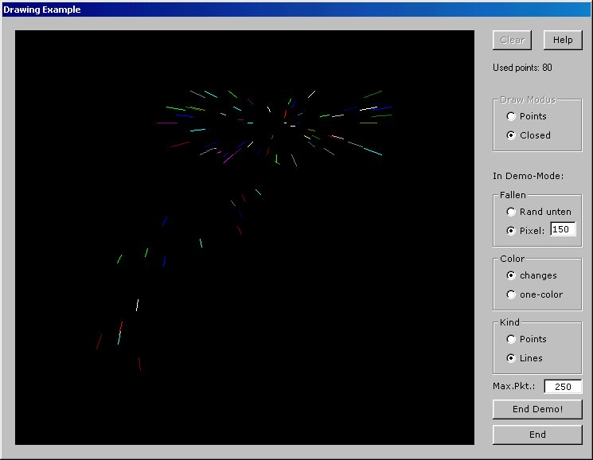



## Draw

### Description

Demonstrates graphical effects under the mousepointer while moving it! Including much options. Learn about simple graphics programming. Windows Function 'SetPixel' used. No ocx needed! Try it - looks GREAT!
 
### More Info
 

             |
---                |---
**Submitted On**   |2001-01-03 01:50:56
**By**             |[Stefan Ebert](https://github.com/Planet-Source-Code/PSCIndex/blob/master/ByAuthor/stefan-ebert.md)
**Level**          |Intermediate
**User Rating**    |4.8 (24 globes from 5 users)
**Compatibility**  |VB 6\.0
**Category**       |[Graphics](https://github.com/Planet-Source-Code/PSCIndex/blob/master/ByCategory/graphics__1-46.md)
**World**          |[Visual Basic](https://github.com/Planet-Source-Code/PSCIndex/blob/master/ByWorld/visual-basic.md)
**Archive File**   |[CODE\_UPLOAD13304122001\.zip](https://github.com/Planet-Source-Code/stefan-ebert-draw__1-14061/archive/master.zip)

